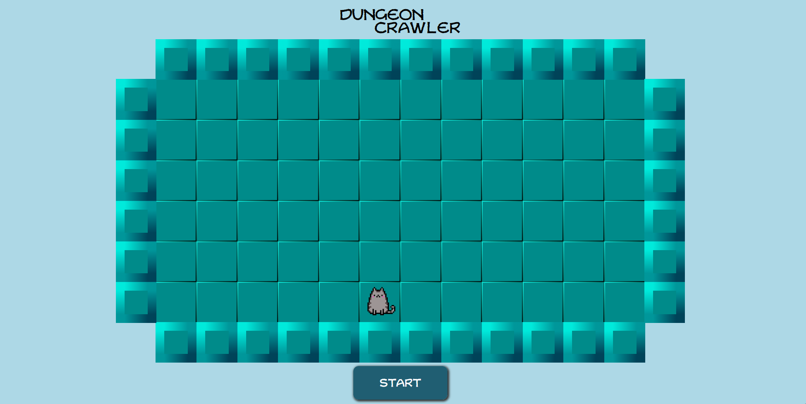

# Dungeon Crawler

## Table of Contents
* [Description](#description)
* [Usage](#usage)
* [Questions](#questions)

## Description
Dungeon Crawler is a top-down game where you play as Nyan and attempt to complete 10 rounds while under attack by the infamous doge army.

## Usage
Press start or spacebar to begin, and use arrows keys to reach the exit of each round.

## Questions
Follow me on [Github](https://github.com/Kayvonk).

To contact me, send an email to kayvonk@gmail.com with your name and inquiry.

Deployed Application: https://kayvonk.github.io/dungeonCrawler/