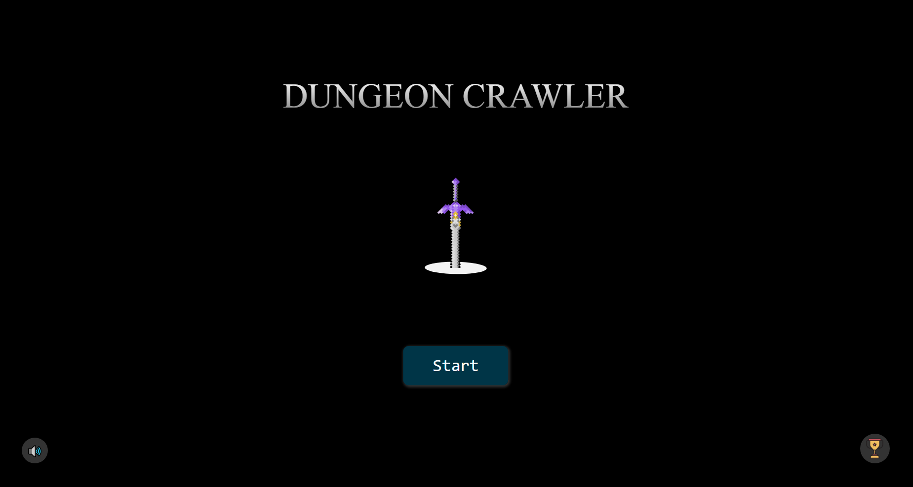

# Dungeon Crawler

## Table of Contents
* [Description](#description)
* [Usage](#usage)
* [Contributions](#contributions)
* [Questions](#questions)

## Description
Dungeon Crawler is a top-down game where you play as Nyan and attempt to climb the tower of the infamous doge army.

## Usage
Click start or press spacebar or enter to begin. Use arrows keys to move around and space to swing the sword once acquired.
Upon entering the tower, navigate to the sigils to move to the next floor. After completing the boss, enjoy the ending, or press enter to skip to the credits screen. If your score qualifies as a high score, provide your initials and press OK to add your score to the Top 100 leaderboard.

## Contributions

Music by Komiku
[link](https://www.chosic.com/free-music/all/?keyword=Komiku&artist)

Minecraft Death Sound from orangefreesounds.com
[link](https://orangefreesounds.com/minecraft-death-sound/)

Game Start sound effect by Pixabay
[link](https://pixabay.com/sound-effects/game-start-6104/)

Game Over sound effect by Epic Stock Media
[link](https://uppbeat.io/sfx/game-over-retro-arcade-1/6581/21829)

Slash sound effect by David Dumais
[link](https://pixabay.com/users/daviddumaisaudio-41768500/?utm_source=link-attribution&utm_medium=referral&utm_campaign=music&utm_content=185432)

Fast Swing sound effect by Pixabay
[link](https://pixabay.com/sound-effects/clean-fast-swooshaiff-14784/)

Teleport sound effect by SmartSound FX
[link](https://uppbeat.io/sfx/arcade-game-retro-8-bit-teleport/914/1603)

Dungeon Crawler CB font by Sadboy
[link](https://www.dafont.com/dungeon-crawler-cb.font)

Highscore Icon by Karyative
[link](https://www.flaticon.com/free-icons/high-score)

Cardboard Box by Vecteezy
[link](https://www.vecteezy.com/free-png/cardboard)

Doge image from FreePNGImg.com
[link](https://freepngimg.com/png/97583-meme-picture-doge-download-free-image)

Buff Doge image from pngall.com
[link](https://www.pngall.com/doge-head-png/download/62187)

Beard image from pngtree.com
[link](https://pngtree.com/freepng/merry-christmas-santa-beard_5665564.html)

Tree image from pngtree.com
[link](https://pngtree.com/freepng/pixel-art-green-tree_7325401.html)

Fire image from toppng.com
[link](https://toppng.com/show_download/172951/amazing-online-background-colour-change-of-photo-piq-pixel-fire)
    
Bongo cat image by bongocat 
[link](https://x.com/itsbongocat") 

Smoke image from pngaaa.com
[link](https://www.pngaaa.com/detail/947337)

Log image from pngaaa.com
[link](https://www.pngaaa.com/detail/3495)

Boulder art by TdeLeeuw on DeviantART
[link](https://www.deviantart.com/tdeleeuw/art/Boulder-pixel-art-427731885)

Super Saiyan Aura art by Rojal
[link](https://www.pngall.com/super-saiyan-aura-png/download/137668)

Cave tile art by Kyrio on deviant art
[link](https://www.deviantart.com/kyrio/art/Pixel-Cave-Interior-Tile-131032682)
  

## Questions
Follow me on [Github](https://github.com/Kayvonk).

To contact me, send an email to kayvonk@gmail.com with your name and inquiry.

Deployed Application: https://kayvonk.github.io/dungeonCrawler/